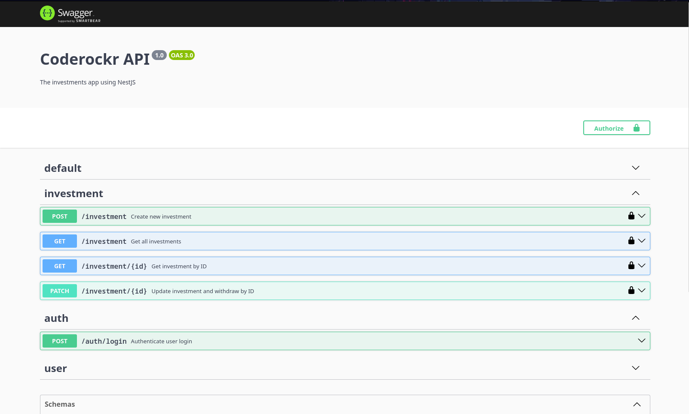
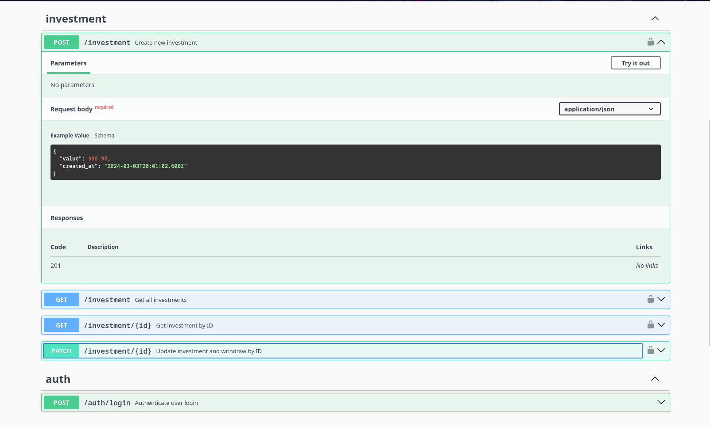
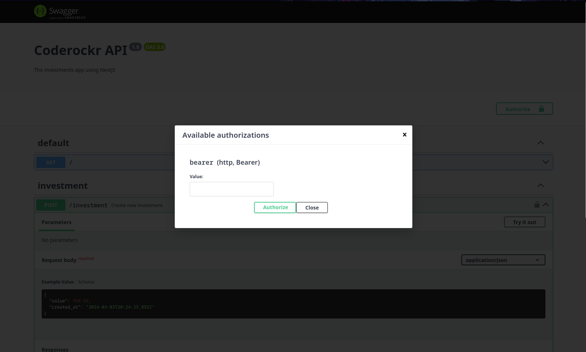
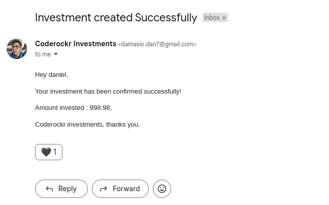

# Investments API Coderockr 🖤



> API RESTFul utilizando NestJS, Docker, Nginx e Postgres. O Objetivo da aplicação é simular operações de investimentos pelo usuário onde é possivel aplicar um determinado valor para investir e depois sacar, levando em consideração os ganhos mensais taxas de saque.

## ☕ Considerações
Optei por utilizar estas tecnologias devido à sua comunidade ativa e engajada, especialmente no caso do NestJS. Além disso, elas são conhecidas por sua confiabilidade em projetos de grande escala e oferecem uma estrutura altamente escalável. Isso me permite desenvolver aplicações robustas e preparadas para o crescimento, atendendo às demandas de complexidade e expansão ao longo do tempo.

## 💻 Pré-requisitos

Para executar o projeto é indispensável ter instalado em sua maquina:

- [Docker](https://www.docker.com/)
- [Docker Compose](https://docs.docker.com/compose/install/)

## 🚀 Instalando

Para instalar a aplicação, siga estas etapas:

Depois de ter clonado o repositório execute o comando para entrar na pasta do projeto:

```
 cd api-coderockr
```

Crie o arquivo que irá conter as variáveis de ambiente da aplicação:
```
 cp .env_example .env
```
Caso o comando anterior não funcione em seu sistema operacional, crie um ".env" com o conteúdo o conteúdo do ".env_example".


Em seguida utilize o comando para gerar o build de nossos containers

```
 docker-compose build
```

Por fim, rode o comando para subir nossa aplicação:
```
 docker-compose up
```

> Todos os testes e migrations das tabelas do banco de dados serão executados pelo entrypoint docker. Sendo possivel vê-los no log do container ao iniciar. 

## ☕ Usando a aplicação

Acesse a documentação da API em [localhost:8000/api#](http://localhost:8000/api#/)



> É fundamental a criação de um usuário para interagir com a aplicação.

Quando autenticar o usuário na rota **auth/login** cole o **access_token** em **Authorize**




## 🚀 Extra
Como parte extra, tomei a liberdade de criar um serviço simples de envio de email ao criar um investimento.




## 📚 Libs utilizadas
- *Swagger* : Documeção dos endpoints da RESTful API em um documento de forma agradável e visual.
- *TypeORM* : Interação e manipulação do banco de dados de maneira simplificada e padronizada.
- *Jest* : Para testes na aplicação. Usado nos modulo e entidade do TypeORM (simples).
- *Class Validator* : Validação dos dados enviados pelo corpo da API. Validações personalizadas ou nativas da bibliotecas. O mesmo ajuda deixar o código mais limpo.
- *JSON Web Token (JWT)* : Criação de dados com assinatura opcional e/ou criptografia. Muito segura para autentição do usuário na API.
- *NodeMailler* : Envio de emails.